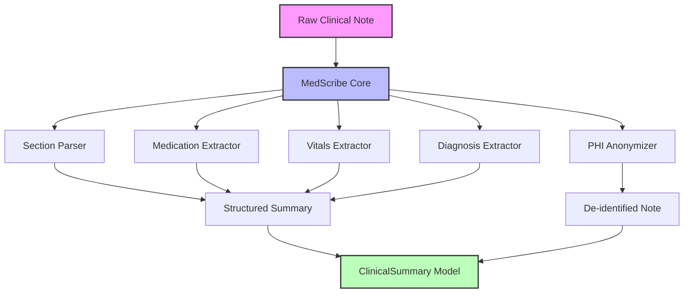

# MedScribe

[](https://github.com/officethree/MedScribe/actions/workflows/ci.yml)
[](https://opensource.org/licenses/MIT)
[](https://www.python.org/downloads/)

**A developer-friendly Python toolkit for processing, summarizing, and structuring clinical/medical notes.**

Inspired by healthcare AI trends but focused on being a practical, regex-based NLP library for medical text — no GPU required.

> **Disclaimer:** MedScribe is intended for **research and educational purposes only**. It is NOT validated for clinical use and should NOT be used for making medical decisions. Always consult qualified healthcare professionals for clinical applications.

---

## Architecture



## Features

- **Section Parsing** — Automatically detect and extract standard clinical note sections (Chief Complaint, HPI, Assessment, Plan, Medications, Vitals, etc.)
- **Medication Extraction** — Identify medication names and dosages from free text using curated regex patterns
- **Vitals Extraction** — Pull out blood pressure, heart rate, temperature, respiratory rate, and SpO2 readings
- **Diagnosis Extraction** — Detect ICD-style diagnosis mentions and clinical condition references
- **Note Summarization** — Convert unstructured clinical notes into structured, machine-readable summaries
- **PHI Anonymization** — Redact patient names, dates, MRN numbers, SSNs, and phone numbers for HIPAA-aligned de-identification

## Quickstart

### Installation

```bash
pip install -e .
```

### Usage

```python
from medscribe import MedScribe

ms = MedScribe()

note = """
Patient: John Smith
DOB: 03/15/1980
MRN: 123456789

Chief Complaint: Chest pain for 2 days.

History of Present Illness:
Mr. Smith is a 46-year-old male presenting with substernal chest pain
radiating to the left arm, onset 2 days ago. Pain is 7/10, worsened
with exertion. No prior cardiac history.

Vitals: BP 142/90, HR 88, Temp 98.6F, RR 18, SpO2 97%

Medications:
- Aspirin 81mg daily
- Lisinopril 10mg daily
- Atorvastatin 40mg nightly

Assessment:
1. Acute chest pain, rule out ACS
2. Hypertension, uncontrolled

Plan:
- Obtain 12-lead ECG and serial troponins
- Start heparin drip per ACS protocol
- Cardiology consult
- Continue home medications
"""

# Parse into sections
sections = ms.parse_note(note)
print(sections.keys())
# dict_keys(['chief_complaint', 'hpi', 'vitals', 'medications', 'assessment', 'plan'])

# Extract medications
meds = ms.extract_medications(note)
print(meds)
# [{'name': 'Aspirin', 'dose': '81mg', 'frequency': 'daily'}, ...]

# Extract vitals
vitals = ms.extract_vitals(note)
print(vitals)
# {'bp': '142/90', 'hr': '88', 'temp': '98.6', 'rr': '18', 'spo2': '97'}

# Full structured summary
summary = ms.summarize(note)
print(summary.chief_complaint)
print(summary.medications)
print(summary.diagnoses)

# Anonymize PHI
clean = ms.anonymize(note)
print(clean)
# All names, dates, MRNs redacted with [REDACTED] markers
```

## Development

```bash
# Install dev dependencies
pip install -e ".[dev]"

# Run tests
make test

# Lint
make lint

# Format
make format
```

## Project Structure

```
MedScribe/
├── src/
│   └── medscribe/
│       ├── __init__.py      # Public API exports
│       ├── core.py          # Main MedScribe class
│       ├── config.py        # Configuration management
│       └── utils.py         # Regex patterns & helpers
├── tests/
│   └── test_core.py         # Unit tests
├── docs/
│   └── ARCHITECTURE.md      # Architecture documentation
├── .github/workflows/
│   └── ci.yml               # CI pipeline
├── pyproject.toml            # Project metadata & dependencies
├── Makefile                  # Dev commands
├── LICENSE                   # MIT License
└── README.md                 # This file
```

## Contributing

See [CONTRIBUTING.md](CONTRIBUTING.md) for guidelines.

## License

MIT License. See [LICENSE](LICENSE) for details.

---

**Built by [Officethree Technologies](https://officethree.com) | Made with ❤️ and AI**
